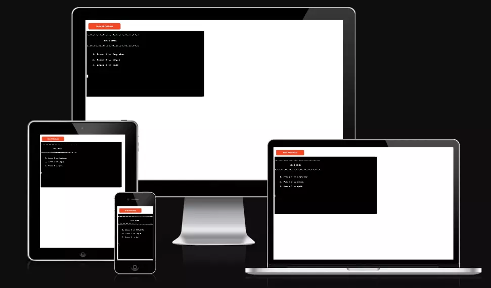
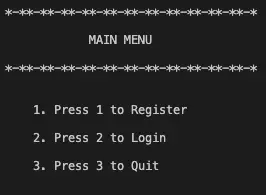
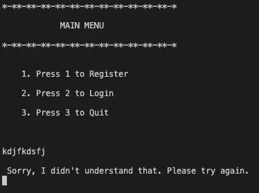
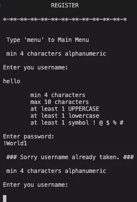
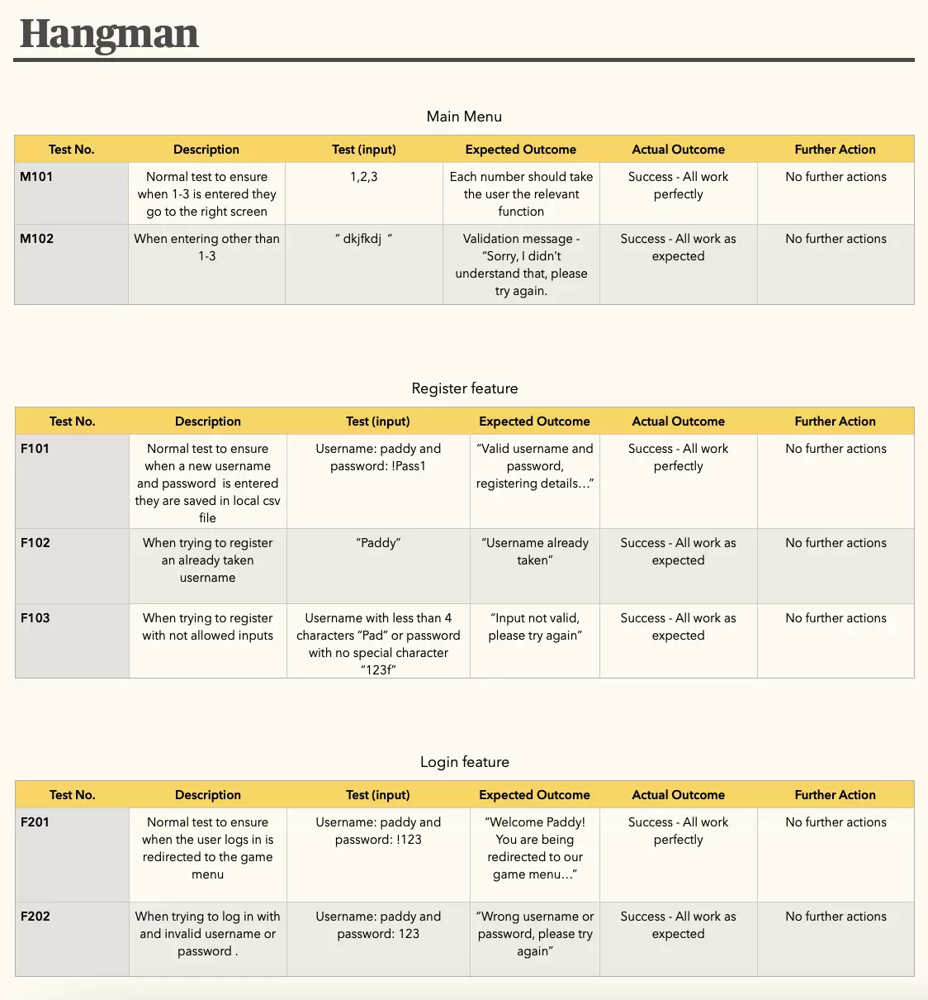

# PP3 - Hangman in Python

-----
## About

Hangman is a Python3 Command Line application. It's a guessing game where the User tries to guess a random  word in a certain number of guesses.

The last update to this file was: **August 22, 2022**

[You can find the live project here](https://hangman-py.herokuapp.com/)

-----
## Responsiveness

Am i responsive?

-----
## How to use the App

[Hangman game wikipedia](https://en.wikipedia.org/wiki/Hangman_(game))

-----
## Features

Main menu

- The main menu is displayed when the application starts. Simple an easy to to understand: 1. New user registration  , 2. User login , 3. Exit.

- Validation message if user enters other that 1,2 or 3.

Registration 

- User is prompted to enter username and password that meets the requirements.

- Validation message appears if invalid input is entered.

- Validation for username already taken.

- User details stored in  local CSV file.

Login

- The user is prompted to enter his/her login credentials.

- User credentials validation

Game menu

- The user is prompted if he/she wants to play of to quit.

- Validation message

Hangman game

- Features: random word, validates right input, live counting, display already guessed words, graphics.

-----
## Design

Flow charts

- 
- 

-----
## Technologies

Languages, External Libraries and Programs Used

- [Python 3](https://www.python.org/)
  - High level language used to build this project version 3.8.11
- [Random](https://docs.python.org/3/library/random.html?highlight=random%20choice#random.choice)
  - Return a random element from the non-empty sequence.
- [String](https://docs.python.org/3/library/string.html?highlight=string#module-string)
  - The uppercase letters 'ABCDEFGHIJKLMNOPQRSTUVWXYZ'.
- [Time](https://docs.python.org/3/library/time.html?highlight=time%20sleep#time.sleep)
  - From time this app uses sleep to pause between screens.
- [Csv](https://docs.python.org/3/library/csv.html?highlight=csv)
  - Comma Separated values file reading and writing.
- [Sys](https://docs.python.org/3/library/sys.html?highlight=sys#module-sys)
  - System-specific parameters and functions.
- [Github](https://github.com/)
  - GitHub is the site used to store the source code for the Website.
- [Git](https://git-scm.com/)
  - Git is the  version control software used to commit and push code to the GitHub repository where the source code is stored.
- [Visual Studio Code](https://code.visualstudio.com/)
  - VS Code for short is the integrated development environment (IDE) software used to build the website.
- [Lucidchart](https://www.lucidchart.com/pages/)
  - Lucidchart was used to create a flowchart of the project.
- [Heroku](https://id.heroku.com)
  - Used to deploy the application and provides an environment where the code can be executed.

-----
## Testing

[PEP8 validator online check](http://pep8online.com/checkresult)

 Result for run.py

-     

Testing table

- 
- 

-----
## Deployment

-----
### How to deploy to Heroku

Steps taken to deploy

- Create an account if necessary and log in.

- Once in the [Heroku](https://id.heroku.com) dashboard, click on New dropdown menu button (top right side) and Create new App.

- On the Create New App page, enter a name for the application and select your region. Then click Create app.

- You will then be brought to the Application Configuration page for your new app.

- Scroll down the Settings page to Buildpacks:
  - Click Add buildpack, select Python from the pop up window and click on Save changes.
  - Click Add buildpack again, select Node.js click on Save changes. It is important that is done in that order Python first, then Node.js beneath.
  - 
- Click on the Deploy tab on the Application Configuration page.
  - Select GitHub as the Deployment Method.
  - Enter your Github username and your Github repository name (in this case https://github.com/JoseMGuerra/hangman) and click on Connect to link up the Heroku app to the GitHub repository code.

- Scroll down the page and there are to options, either Automatically Deploy each time changes are pushed to GitHub, or Manually deploy - for this project Automatic Deploy was selected.

- The application can be run by clicking on the Open App button at the top of the Application Configuration page.

- The live link for this project is (https://hangman-py.herokuapp.com/)

-----
## Resources / Credits / Inspiration

- [Python documentation](https://docs.python.org/3/)
- [W3Schools documentation](https://www.w3schools.com/python/default.asp)
- [Love sandwiches project](https://food-market-stock.herokuapp.com/)

-----
## Acknowledgments

- Thank you to my mentor Brian Macharia for guiding me and for his invaluable advice.

-----
## Constraints

The deployment terminal is set to 80 columns by 24 rows. That means that each line of text needs to be 80 characters or less otherwise it will be wrapped onto a second line.

-----
Happy coding!